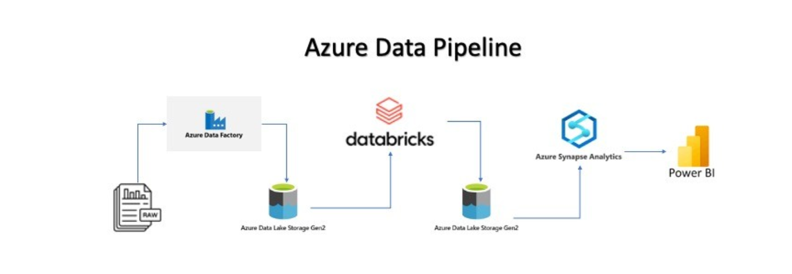
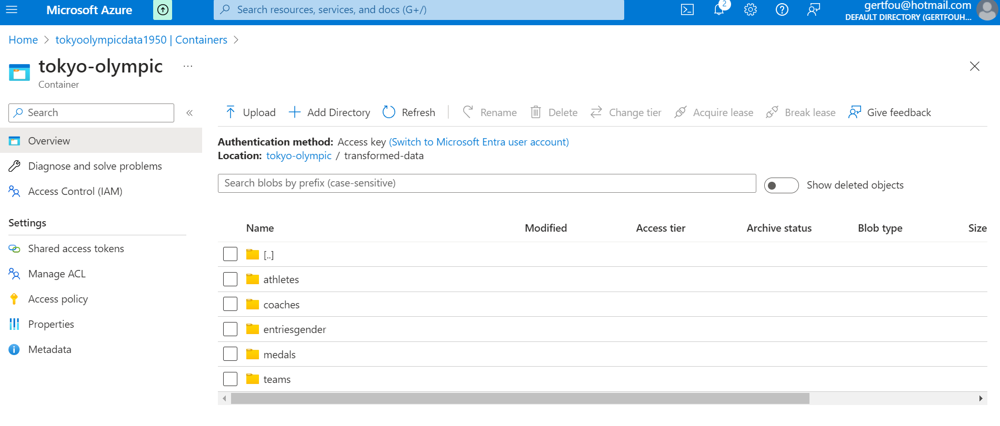
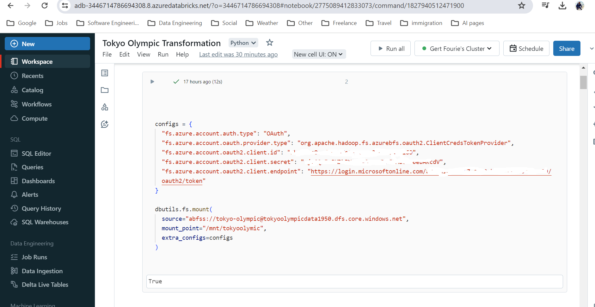
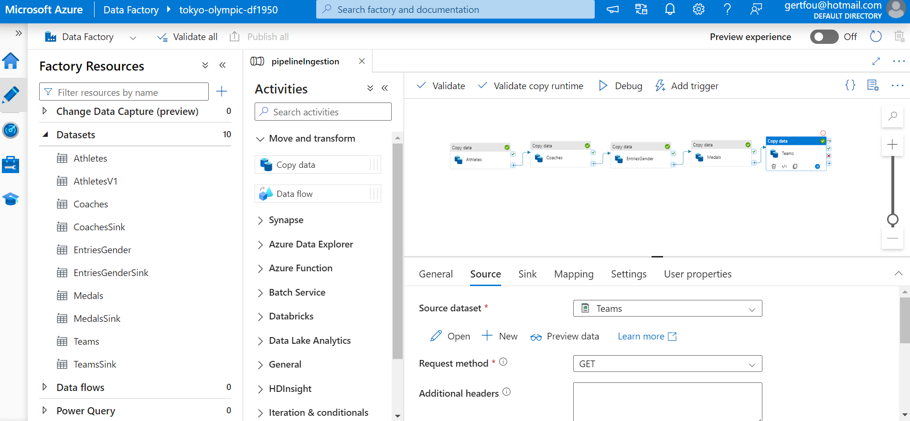

# AzureDataEngineeringTokyoOlympicsData
#### Part one ref: https://www.youtube.com/watch?v=IaA9YNlg5hM
#### Part two ref: https://www.youtube.com/watch?v=nW0ffUW2vw4
#### Part one: 
##### Extract data from the API, useing Azure data factory to build a data pipeline. Get data from github raw url.  
##### Load data on Azure datalake storage(In Container). Load raw data and then use Azure Databricks to write spark code to transform the data. 
##### Such as making sure headers are shows, and data is correct type, intiger, string etc, basic evaluation, 
##### run some code to display gold medals per country form high to low and display a bar graph to show sum of sport activities, high to low. 
##### Load data back to our transformed datalake storage(In container). 
#### Part two:
##### Run Azure synaps analytics and run sql queries on top of the transformed data to visualize our data. 
##### Visualization tools that can be used is Microsoft BI, Tableau, looker studio. etc. 
 
####### ref: https://www.linkedin.com/pulse/azure-end-to-end-data-pipeline-sajad-ahmadi-xrqze/

