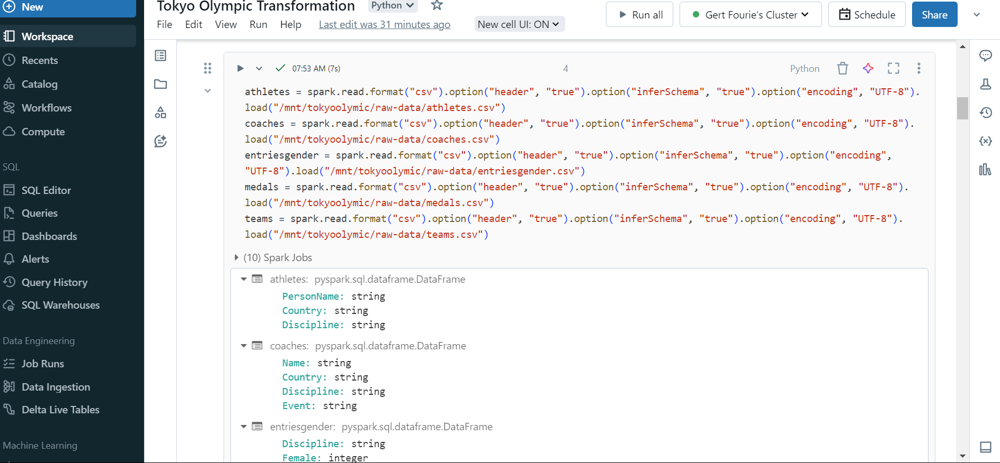

# AzureDataEngineeringTokyoOlympicsData
#### Part one ref: https://www.youtube.com/watch?v=IaA9YNlg5hM
#### Part two ref: https://www.youtube.com/watch?v=nW0ffUW2vw4
## Part one: Azure Data Container, Data Factory (Build Pipeline), Databricks & Datalakes. 
##### Extract data from the API, useing Azure data factory to build a data pipeline. Get data from github raw url.  
##### Load data on Azure datalake storage(In Container). Load raw data and then use Azure Databricks to write spark code to transform the data. 
##### Such as making sure headers are showing, and data is correct type, intiger, string etc, basic evaluation, 
##### run some code to display gold medals per country form high to low and display a bar graph to show sum of sport activities, high to low. 
##### Load data back to our transformed datalake storage(In container). 
## Part two: Azure Synaps Analytics with SQL
##### Run Azure synaps analytics and run sql queries on top of the transformed data to visualize our data. 
##### Visualization tools that can be used is Microsoft BI, Tableau, looker studio. etc. 
## Make sure you create an Azure and power BI account with a company account, otherwise when you want to
## import data from PowerBI to Azure Synapse with 'get data', you need to transfer project from non company account to company account
## (If you created it with a normal email account),
## create network and admin roles, which may not work and you must get PowerBI Pro. 
## Alternatively, load data as .csv into PowerBI and Create your Data Analysis Dashboard without a workspace. 
## A good Udemy course on POWERBI is from Phillip Burton, I Do Data. Try it!! :)
 
###### ref: https://www.linkedin.com/pulse/azure-end-to-end-data-pipeline-sajad-ahmadi-xrqze/

